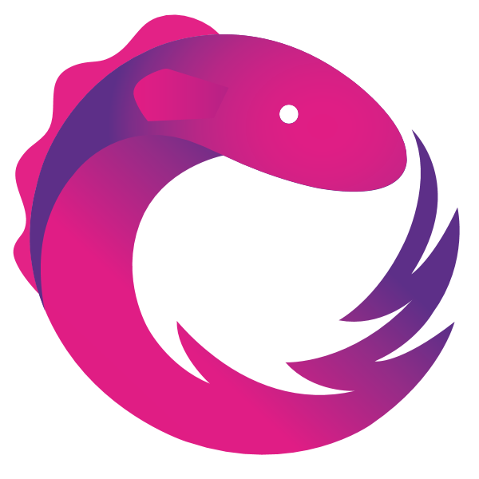
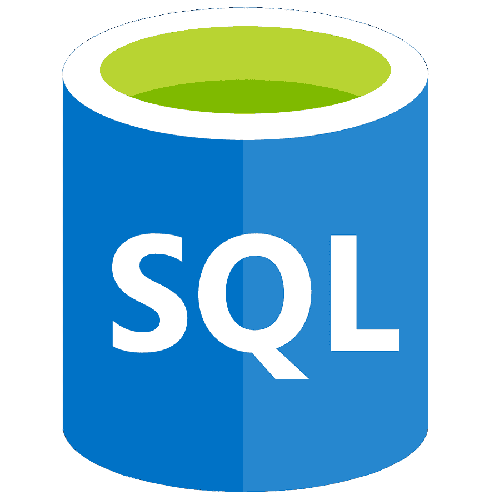
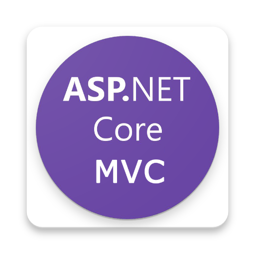
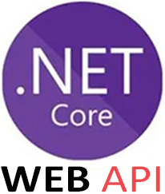

# Hi, I'm Nikola Ilievski

I'm a dedicated student at SEDC, aspiring to become a proficient full-stack developer. Although this marks the beginning of my career, I'm excited for new challenges and thrilled to see what the future has in store for me.

## Want to learn more about me?

### Technologies I use:

	<code></code>
	<code></code>
	<code></code>
	<code></code>
	<code></code>
	<code></code>
	<code></code>
    <code></code>
	<code></code>
    <code></code>
	<code></code>
	<code></code>
	<code></code>
    <code></code>
	<code></code>
	<code></code>
	<code></code>

### Software I use:

	<code></code>
	<code></code>
    <code></code>
	<code></code>
	<code></code>
	<code></code>
	<code></code>
	<code></code>
	<code></code>

---

| GitHub Stats | Top Languages |
| --- | --- |
|  |  |